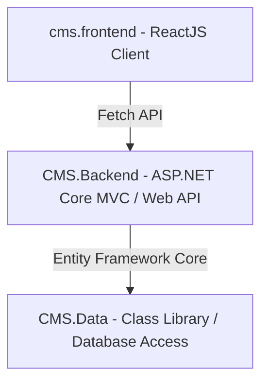

# Đồ án Môn học: Hệ thống Quản trị Bán hàng và Tin tức (CMS) Full-Stack

> [!NOTE]
> Dự án được xây dựng dựa trên kiến trúc 3 lớp (3-tier Architecture) nhằm tách biệt rõ ràng giữa Dữ liệu, Logic xử lý và Giao diện người dùng cuối.
> Dự án này được thực hiện trong khuôn khổ môn học **Chuyên đề ASP.NET**.

---

## 👤 THÔNG TIN SINH VIÊN

| Thông tin                          | Chi tiết               |
| :---------------------------------- | :---------------------- |
| **Sinh viên thực hiện**    | Nguyễn Quỳnh Thảo Vy |
| **Mã số sinh viên (MSSV)** | 2123110158              |
| **Lớp**                      | CCQ2311E                |
| **Môn học**                 | Chuyên đề ASP.NET    |
| **Tên Solution**             | VyCMS_Solution          |

---

## 🏛️ 1. TỔNG QUAN KIẾN TRÚC HỆ THỐNG

Kiến trúc ứng dụng được phân bổ thành 3 lớp riêng biệt:



- **`CMS.Data`**: Lớp thao tác cơ sở dữ liệu (Data Access Layer). Định nghĩa các thực thể (Entities), thiết lập mối quan hệ và cấu hình DbContext cho Entity Framework Core.
- **`CMS.Backend`**: Lớp xử lý nghiệp vụ trung tâm (Business Logic Layer & Presentation Layer cho Admin). Được viết bằng ASP.NET Core 8 MVC để làm màn hình quản trị (Admin Panel), đồng thời cung cấp Web API cho client.
- **`cms.frontend`**: Lớp giao diện người dùng cuối (Client-side Presentation Layer). Phát triển bằng ReactJS để người dùng đọc tin tức và mua sắm sản phẩm.

---

## 📁 2. CẤU TRÚC THƯ MỤC DỰ ÁN

```text
VyCMS_Solution/
├── VyCMS_Solution.sln           # File Solution tổng quản lý các project
├── CMS.Data/                    # Project Class Library (.NET 8)
│   └── Entities/                # Định nghĩa các lớp thực thể cốt lõi
├── CMS.Backend/                 # Project ASP.NET Core 8 Web App (MVC & Web API)
│   ├── Controllers/             # Logic xử lý điều hướng & cung cấp API
│   ├── Models/                  # Các ViewModel truyền dữ liệu
│   ├── Views/                   # Giao diện quản trị Admin Panel (.cshtml)
│   └── appsettings.json         # Cấu hình hệ thống & chuỗi kết nối Database
├── cms.frontend/                # Project ReactJS (Client)
│   ├── public/                  # Tài nguyên tĩnh của React
│   └── src/                     # Mã nguồn logic giao diện người dùng
│       ├── api/                 # Cấu hình gọi API
│       ├── assets/              # Tài nguyên tĩnh (hình ảnh, css)
│       ├── components/          # Các thành phần giao diện tái sử dụng
│       ├── pages/               # Các trang chức năng (Home, Cart, Product...)
│       └── services/            # Các service gọi API lấy dữ liệu
├── ImageDownloader/             # Công cụ Console hỗ trợ tải ảnh hàng loạt
└── TempSqlRunner/               # Công cụ Console hỗ trợ chạy script SQL tùy chỉnh
```

---

## ⚙️ 3. CHI TIẾT CÁC MODULE TRONG HỆ THỐNG

### 3.1. Dự án `CMS.Data` (Lớp dữ liệu / Entity)

Thư mục `Entities` định nghĩa 10 bảng dữ liệu cốt lõi, phục vụ cho hai phân hệ nghiệp vụ chính là **Tin tức**, **Bán hàng** và **Giao diện**:

| Tên Model (Entity)           | Chức năng nghiệp vụ                                  | Mối quan hệ                                               |
| :---------------------------- | :------------------------------------------------------- | :---------------------------------------------------------- |
| **`Category`**        | Quản lý danh mục bài viết / tin tức                | Quan hệ 1 - N với`Post`                                 |
| **`Post`**            | Quản lý nội dung bài viết tin tức                  | Quan hệ N - 1 với`Category`                             |
| **`CategoryProduct`** | Quản lý nhóm / danh mục của sản phẩm              | Quan hệ 1 - N với`Product`                              |
| **`Product`**         | Quản lý thông tin hàng hóa, sản phẩm              | Quan hệ N - 1 với`CategoryProduct`                      |
| **`Customer`**        | Thông tin khách hàng đặt mua                        | Quan hệ 1 - N với`Order`                                |
| **`Order`**           | Quản lý hóa đơn / đơn hàng tổng                 | Quan hệ N - 1 với`Customer`, 1 - N với `OrderDetail` |
| **`OrderDetail`**     | Chi tiết từng mặt hàng trong đơn hàng             | Quan hệ N - 1 với`Order`, N - 1 với `Product`        |
| **`User`**            | Quản lý tài khoản đăng nhập (Admin)               | Độc lập                                                  |
| **`Menu`**            | Quản lý menu điều hướng hiển thị ở giao diện   | Độc lập                                                  |
| **`Banner`**          | Quản lý hình ảnh banner quảng cáo trên trang chủ | Độc lập                                                  |

---

### 3.2. Dự án `CMS.Backend` (Hệ thống quản trị)

Gồm các Controller xử lý các luồng dữ liệu (CRUD) theo mô hình MVC, sử dụng Dependency Injection để tiêm `ApplicationDbContext` tương tác trực tiếp với cơ sở dữ liệu:

- **`HomeController`**: Quản lý trang chủ Admin (hiển thị bài viết mới, Dashboard thống kê).
- **`CategoryController`**: Xử lý thêm, sửa, xóa danh mục bài viết.
- **`PostController`**: Quản lý các bài viết tin tức (tích hợp CKEditor và upload file ảnh).
- **`ProductController` / `CategoryProductController`**: Xử lý nghiệp vụ danh mục hàng hóa và sản phẩm.
- **`OrderController` / `OrderDetailController`**: Theo dõi và cập nhật trạng thái các đơn hàng.
- **`CustomerController` / `UserController`**: Quản lý tệp khách hàng và phân quyền tài khoản quản trị (Admin/Editor).
- **`MenuController` / `BannersController`**: Quản lý các menu và banner hiển thị trên giao diện người dùng cuối.
- **`...ApiController`**: Các API Controller cung cấp dữ liệu JSON cho frontend ReactJS.

---

### 3.3. Dự án `cms.frontend` (Giao diện người dùng cuối)

- **Công nghệ**: ReactJS (React).
- **Nhiệm vụ**: Cung cấp giao diện xem tin tức và mua sắm sản phẩm cho khách hàng. Fetch dữ liệu trực tiếp từ các API do lớp `CMS.Backend` cung cấp thay vì kết nối trực tiếp vào cơ sở dữ liệu.

---

## 🚀 4. HƯỚNG DẪN CÀI ĐẶT VÀ KHỞI CHẠY DỰ ÁN

### Yêu cầu môi trường

- .NET 8 SDK
- Node.js (Bản LTS)
- IDE: Visual Studio 2022 (hoặc VS Code)

### 🔹 Bước 1: Khởi động Backend (ASP.NET Core)

1. Mở Solution bằng Visual Studio hoặc VS Code.
2. Thiết lập dự án **`CMS.Backend`** làm Startup Project (Chuột phải vào `CMS.Backend` -> chọn **Set as Startup Project**).
3. Nhấn `F5` hoặc nút `Start` để chạy dự án. Hệ thống sẽ cấp phát một cổng chạy local (Ví dụ: `https://localhost:7030`).
4. _Cách chạy bằng Terminal:_
   ```bash
   cd CMS.Backend
   dotnet run
   ```

### 🔹 Bước 2: Khởi động Frontend (ReactJS)

1. Mở một cửa sổ Terminal (hoặc Command Prompt) mới.
2. Di chuyển vào thư mục Frontend:
   ```bash
   cd cms.frontend
   ```
3. Cài đặt các thư viện phụ thuộc (chỉ làm lần đầu):
   ```bash
   npm install
   ```
4. Khởi chạy ứng dụng:
   ```bash
   npm run dev
   ```
5. Trình duyệt sẽ tự động mở trang web tại địa chỉ `http://localhost:3000`.

---

## 📝 Bản quyền & Phát triển

Đồ án được thực hiện bởi sinh viên **Nguyễn Quỳnh Thảo Vy**. Mọi source code và tài liệu được sử dụng với mục đích học tập môn Chuyên đề ASP.NET.
